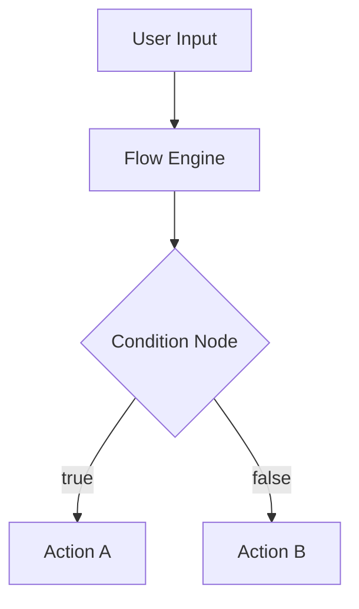

# XOpen Mdoc Factory

> **Turn any product idea into a complete documentation package — in one command.**

A [WorkBuddy](https://www.codebuddy.cn) Skill that generates professional-grade project documentation sets from a single description. 18 document types. 7 layers. Zero boilerplate.

---

## What It Does

Describe your product. Get back a full, structured documentation package ready for version control — PRD, tech stack spec, architecture design, API reference, database schema, security design, design system, DevOps guide, and more.

All documents are:
- Written in Markdown (version control friendly)
- Consistent with each other (shared terminology, cross-referenced)
- Structured with Mermaid diagrams, tables, and code blocks
- Available in Chinese or English

---

## Quick Start

Install the Skill into WorkBuddy:

```bash
git clone https://github.com/XOpenWorld/XOpen-Mdoc-Factory \
  ~/.workbuddy/skills/xopen-mdoc-factory
```

Then use it in any WorkBuddy conversation:

```
/mdoc my-product
```

---

## Commands

```
/mdoc [product]                    Generate the full documentation set
/mdoc [product] [type]             Generate a single document
/mdoc [product] [type1] [type2]    Generate multiple documents
```

### Examples

```bash
/mdoc flow                         # Full docs for XOpen Flow
/mdoc mdoc prd                     # Just the PRD for Mdoc
/mdoc agent tech api db            # Tech stack + API + Database for XOpen Agent
/mdoc "my-saas-app"                # Works with any product name
```

### Document Type Aliases

| Alias | Document |
|-------|----------|
| `prd` | Product Requirements Document |
| `vision` | Product Vision & Strategy |
| `roadmap` | Development Roadmap |
| `tech` | Tech Stack Specification |
| `arch` | Architecture Design |
| `api` | API Specification |
| `db` | Database Schema |
| `security` | Security Design |
| `design` | Design System |
| `ui` | UI Specification |
| `component` | Component Library Spec |
| `devops` | DevOps Guide |
| `test` | Testing Strategy |
| `i18n` | i18n Specification |
| `contributing` | Contributing Guide |
| `changelog` | Changelog |
| `onboarding` | Onboarding Design |
| `competitive` | Competitive Analysis |

---

## Document Set (18 types, 7 layers)

```
{product}-docs/
├── 00-README.md
├── 01-strategy/
│   ├── product-vision.md          Brand positioning, user personas, business model
│   └── roadmap.md                 Timeline, milestones, phased delivery
├── 02-product/
│   ├── prd.md                     Features, user stories, acceptance criteria
│   ├── competitive-analysis.md    Competitor matrix, differentiation
│   └── onboarding-design.md       First-run experience, empty states
├── 03-design/
│   ├── design-system.md           Tokens, typography, spacing, breakpoints
│   ├── ui-specification.md        Page flows, states, animations
│   └── component-library.md       Component API, variants, accessibility
├── 04-engineering/
│   ├── tech-stack.md              Framework comparisons, decision rationale
│   ├── architecture.md            Module diagram, data flow, service boundaries
│   ├── api-specification.md       REST/WebSocket endpoints, schemas, error codes
│   ├── database-schema.md         ER diagram, DDL, indexes, RLS policies
│   └── security-design.md         Auth, encryption, CSRF/XSS/SQLi, compliance
├── 05-operations/
│   ├── devops-guide.md            CI/CD, environments, deployment, monitoring
│   └── testing-strategy.md        Test pyramid, coverage targets, E2E scenarios
├── 06-i18n/
│   └── i18n-specification.md      Locale formats, translation workflow, glossary
└── 07-community/
    ├── contributing-guide.md       Dev setup, coding standards, PR process
    └── changelog.md                Version history (Keep a Changelog format)
```

---

## Natural Language Triggers

No slash command needed — just describe what you want:

```
帮我写 XOpen Flow 的 PRD
给 XOpen Agent 生成技术选型文档
补全 Mdoc 的数据库设计
文档工厂，帮我生成一套完整的项目文档
```

---

## Output Example

Running `/mdoc flow prd` produces a document like:

```markdown
# XOpen Flow — Product Requirements Document
Version: 1.0 | Date: 2026-03-29 | Status: Draft

## 1. Product Overview
XOpen Flow is a visual workflow orchestration tool...

## 2. User Personas
| Persona | Description | Pain Points |
|---------|-------------|-------------|
| ...

## 3. Feature Requirements
### F1: Drag-and-Drop Canvas
**Priority**: P0 | **Effort**: L
**User Story**: As a developer, I want to...
**Acceptance Criteria**:
- [ ] ...

## 4. Non-Functional Requirements
...
```

All documents include Mermaid diagrams where appropriate:



---

## Requirements

- [WorkBuddy](https://www.codebuddy.cn) (latest version)
- No API keys needed — runs entirely within the AI conversation

---

## Installation

### Option 1: Git Clone (Recommended)

```bash
git clone https://github.com/XOpenWorld/XOpen-Mdoc-Factory \
  ~/.workbuddy/skills/xopen-mdoc-factory
```

### Option 2: Manual Download

1. Download this repository as a ZIP
2. Extract to `~/.workbuddy/skills/xopen-mdoc-factory/`
3. Restart WorkBuddy

### Verify Installation

In WorkBuddy, type:
```
/mdoc test
```

You should see the Skill acknowledge the command and ask for confirmation before generating.

---

## Customization

### Adding Your Own Templates

Edit any file in `references/` to customize the structure for your team:

```
references/
├── prd.md              ← Customize PRD structure
├── tech-stack.md       ← Customize tech spec format
└── ...                 ← 18 templates total
```

Each template uses `<!-- FILL: field description -->` as placeholder markers.

### For Enterprise Teams

The `security-design.md` template includes a Compliance section. Uncomment the relevant frameworks (SOC 2, ISO 27001, GDPR) for your needs.

---

## Part of the XOpen Ecosystem

**XOpen Mdoc Factory** is a free, open-source Skill built for the XOpen product ecosystem.

| Product | Description | Status |
|---------|-------------|--------|
| [XOpen Mdoc](https://github.com/XOpenWorld/XOpen-Mdoc) | AI-native Markdown editor | 🚧 MVP |
| **XOpen Mdoc Factory** | Project documentation generator | ✅ Available |
| XOpen Flow | Visual workflow orchestration | 📋 Planned |
| XOpen Agent | AI Agent manager | 📋 Planned |
| XOpen AI Proxy | Unified LLM API gateway | 📋 Planned |

---

## Contributing

Pull requests welcome. Please read [`references/contributing-guide.md`](references/contributing-guide.md) first.

Key areas where contributions help most:
- **New templates** — domain-specific document types (mobile apps, hardware, data science)
- **Language support** — document templates in other languages
- **Template quality** — better examples, more specific field descriptions

---

## License

MIT License — free for personal and commercial use.

---

<p align="center">
  Built with ❤️ by <a href="https://xopen.world">XOpen</a>
</p>
