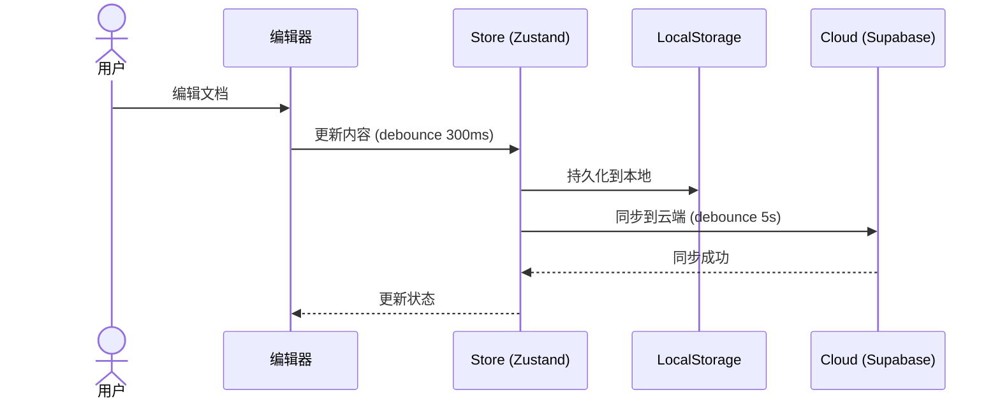
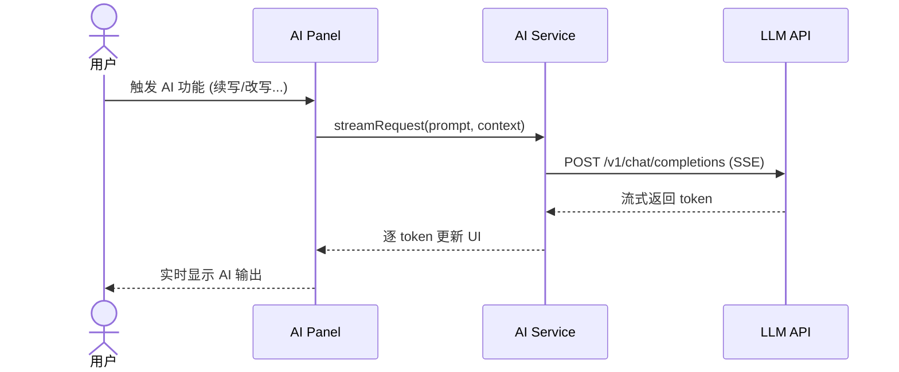

# 🏗️ 技术架构设计 (Architecture Design)

> **📌 模板说明**: 本文档定义系统的整体架构、模块划分、数据流和通信协议。是开发团队的技术蓝图。AI 填写时请替换所有 `<!-- FILL -->` 占位符。

---

## 🗂️ 元数据

| 字段 | 内容 |
|------|------|
| 📦 产品名称 | <!-- FILL --> |
| 🔖 版本 | <!-- FILL --> |
| 📅 日期 | <!-- FILL: YYYY-MM-DD --> |
| 👤 作者 | <!-- FILL --> |

---

## 🌐 1. 系统架构总览

```mermaid
graph TB
    subgraph 客户端层
        A[<!-- FILL: Web App (React) -->]
        B[<!-- FILL: 桌面端 (Tauri) -->]
        C[<!-- FILL: 移动端 (PWA) -->]
    end

    subgraph 服务层
        D[<!-- FILL: Supabase API -->]
        E[<!-- FILL: AI Service -->]
        F[<!-- FILL: Edge Functions -->]
    end

    subgraph 基础设施层
        G[<!-- FILL: PostgreSQL -->]
        H[<!-- FILL: Object Storage -->]
        I[<!-- FILL: CDN -->]
    end

    A --> D
    B --> D
    A --> E
    D --> G
    D --> H
    A --> I
```

---

## 🧩 2. 模块划分

### 2.1 💻 客户端模块

| 模块 | 职责 | 核心接口 | 依赖 |
|------|------|----------|------|
| <!-- FILL: editor --> | <!-- FILL: 文档编辑核心 --> | <!-- FILL: EditorView, EditorState --> | <!-- FILL: codemirror --> |
| <!-- FILL: preview --> | <!-- FILL: Markdown 渲染预览 --> | <!-- FILL: renderMarkdown() --> | <!-- FILL: remark/rehype --> |
| <!-- FILL: store --> | <!-- FILL: 全局状态管理 --> | <!-- FILL: useDocumentStore(), useAuthStore() --> | <!-- FILL: zustand --> |
| <!-- FILL: ai --> | <!-- FILL: AI 辅助功能 --> | <!-- FILL: aiService.stream() --> | <!-- FILL: fetch/SSE --> |
| <!-- FILL: sync --> | <!-- FILL: 云端同步 --> | <!-- FILL: upload(), download() --> | <!-- FILL: supabase-js --> |
| <!-- FILL: ui --> | <!-- FILL: 通用UI组件 --> | <!-- FILL: Button, Modal, Toast --> | <!-- FILL: react --> |

### 2.2 ☁️ 服务端模块

| 模块 | 职责 | 核心接口 | 依赖 |
|------|------|----------|------|
| <!-- FILL: auth --> | <!-- FILL: 用户认证 --> | <!-- FILL: signUp(), signIn() --> | <!-- FILL: supabase-auth --> |
| <!-- FILL: storage --> | <!-- FILL: 文件存储 --> | <!-- FILL: upload(), getPublicUrl() --> | <!-- FILL: supabase-storage --> |
| <!-- FILL: realtime --> | <!-- FILL: 实时订阅 --> | <!-- FILL: subscribe() --> | <!-- FILL: supabase-realtime --> |

---

## 🔄 3. 数据流图

### 3.1 🖊️ 核心用户流程



### 3.2 🤖 AI 辅助流程



---

## 🗄️ 4. 状态管理架构

### 4.1 📊 状态分层

```
┌─ Server State ─────────────────────────┐
│  数据库 (PostgreSQL via Supabase)        │
│  缓存 (React Query / SWR)              │
└────────────────────────────────────────┘
        ↕ 同步
┌─ Client State ─────────────────────────┐
│  Global Store (Zustand)                │
│    ├── documentStore (文档/文件夹/标签) │
│    ├── authStore (认证/用户)            │
│    └── editorStore (编辑器设置)         │
│  Local State (useState/useReducer)     │
│    ├── 组件内部状态                      │
│    └── 表单临时状态                      │
└────────────────────────────────────────┘
        ↕ 持久化
┌─ Persistent Storage ───────────────────┐
│  LocalStorage (文档草稿/设置)           │
│  IndexedDB (大文件缓存) [可选]          │
└────────────────────────────────────────┘
```

### 4.2 💾 缓存策略

| 数据类型 | 缓存位置 | TTL | 失效策略 |
|----------|----------|-----|----------|
| <!-- FILL: 用户信息 --> | <!-- FILL: Zustand --> | <!-- FILL: Session --> | <!-- FILL: 登出清除 --> |
| <!-- FILL: 文档列表 --> | <!-- FILL: Zustand + Supabase --> | <!-- FILL: 5min --> | <!-- FILL: 手动刷新 --> |
| <!-- FILL: 编辑器设置 --> | <!-- FILL: LocalStorage --> | <!-- FILL: 永久 --> | <!-- FILL: 用户修改 --> |

---

## 📡 5. API 通信协议

| 场景 | 协议 | 原因 |
|------|------|------|
| <!-- FILL: CRUD 操作 --> | <!-- FILL: REST (Supabase Client) --> | <!-- FILL: 简单直接，自动类型生成 --> |
| <!-- FILL: 实时同步 --> | <!-- FILL: WebSocket (Supabase Realtime) --> | <!-- FILL: 多设备实时更新 --> |
| <!-- FILL: AI 流式输出 --> | <!-- FILL: SSE (Server-Sent Events) --> | <!-- FILL: 单向流，比 WS 轻量 --> |
| <!-- FILL: 文件上传 --> | <!-- FILL: Multipart POST --> | <!-- FILL: 大文件分片上传 --> |

---

## 🔐 6. 认证与授权流程

```mermaid
flowchart TD
    A[用户注册/登录] --> B{方式?}
    B -->|邮箱密码| C[Supabase Auth.signIn()]
    B -->|OAuth| D[Supabase Auth.signInWithOAuth()]
    C --> E[获取 JWT Access Token]
    D --> E
    E --> F[存储 Token 到 Store]
    F --> G[所有请求携带 Authorization Header]
    G --> H[Supabase RLS 自动校验权限]
```

---

## 🔌 7. 第三方集成

| 服务 | 用途 | 接入方式 | 费用 |
|------|------|----------|------|
| <!-- FILL: Supabase --> | <!-- FILL: BaaS --> | <!-- FILL: JS SDK --> | <!-- FILL: 免费层 + 按量 --> |
| <!-- FILL: DeepSeek API --> | <!-- FILL: AI 能力 --> | <!-- FILL: REST API --> | <!-- FILL: 按 Token 计费 --> |
| <!-- FILL: Cloudflare --> | <!-- FILL: CDN --> | <!-- FILL: DNS + CDN --> | <!-- FILL: 免费层 --> |

---

## 📁 8. 代码仓库规划

```
<!-- FILL: Monorepo 目录结构 -->
{project-root}/
├── apps/
│   ├── web/                    <!-- Web 应用 -->
│   │   ├── src/
│   │   │   ├── components/     <!-- UI 组件 -->
│   │   │   ├── stores/         <!-- 状态管理 -->
│   │   │   ├── services/       <!-- 服务层 -->
│   │   │   ├── types/          <!-- TypeScript 类型 -->
│   │   │   ├── lib/            <!-- 工具函数 -->
│   │   │   └── App.tsx
│   │   ├── public/
│   │   └── package.json
│   └── desktop/                <!-- 桌面端 (Tauri) -->
│       ├── src-tauri/
│       └── package.json
├── packages/
│   ├── shared/                 <!-- 共享类型/工具 -->
│   └── ui/                     <!-- 共享 UI 组件 -->
├── supabase/
│   ├── migrations/             <!-- 数据库迁移 -->
│   └── seed.sql
├── docs/                       <!-- 项目文档 -->
├── pnpm-workspace.yaml
├── turbo.json
└── package.json
```

---

## 🚀 9. 扩展性设计

### 9.1 📈 水平扩展

<!-- FILL: 描述系统如何从单机扩展到多机 -->

### 9.2 🔌 插件化

<!-- OPTIONAL -->
<!-- FILL: 描述插件/扩展机制 -->

### 9.3 🏢 微服务拆分预留

<!-- OPTIONAL -->
<!-- FILL: 描述未来可能的拆分点 -->

---

> **✅ 质量检查**: ✓ 架构图清晰（含分层图）✓ 模块职责明确 ✓ 数据流可追踪（含序列图）✓ 通信协议有理有据 ✓ 扩展性考虑充分
