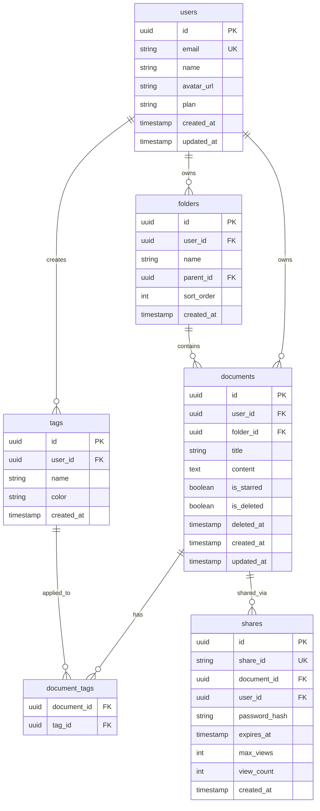

# 数据库设计文档模板
<!-- FILL: 产品名称 -->
**产品**: <!-- FILL: Product Name -->
**数据库**: PostgreSQL <!-- FILL: 版本 -->（推荐 via Supabase）
**文档版本**: 0.1.0
**最后更新**: <!-- FILL: YYYY-MM-DD -->
**状态**: Draft / Review / Final

---

## 1. ER 图



---

## 2. 表结构定义

### 2.1 users — 用户表

| 字段名 | 类型 | 约束 | 默认值 | 描述 |
|--------|------|------|--------|------|
| id | uuid | PK | gen_random_uuid() | 用户唯一标识 |
| email | varchar(255) | NOT NULL, UNIQUE | — | 登录邮箱 |
| name | varchar(100) | NOT NULL | — | 显示名称 |
| avatar_url | text | — | NULL | 头像 URL |
| plan | varchar(20) | NOT NULL | 'free' | free / pro / team |
| storage_used | bigint | NOT NULL | 0 | 已用存储（字节） |
| storage_limit | bigint | NOT NULL | 104857600 | 存储上限，默认 100MB |
| last_login_at | timestamp with time zone | — | NULL | 上次登录时间 |
| created_at | timestamp with time zone | NOT NULL | now() | 创建时间 |
| updated_at | timestamp with time zone | NOT NULL | now() | 更新时间 |

**DDL**:
```sql
CREATE TABLE users (
  id          UUID PRIMARY KEY DEFAULT gen_random_uuid(),
  email       VARCHAR(255) NOT NULL UNIQUE,
  name        VARCHAR(100) NOT NULL,
  avatar_url  TEXT,
  plan        VARCHAR(20)  NOT NULL DEFAULT 'free',
  storage_used  BIGINT NOT NULL DEFAULT 0,
  storage_limit BIGINT NOT NULL DEFAULT 104857600,
  last_login_at TIMESTAMPTZ,
  created_at  TIMESTAMPTZ NOT NULL DEFAULT now(),
  updated_at  TIMESTAMPTZ NOT NULL DEFAULT now()
);
```

---

### 2.2 folders — 文件夹表

| 字段名 | 类型 | 约束 | 默认值 | 描述 |
|--------|------|------|--------|------|
| id | uuid | PK | gen_random_uuid() | 文件夹唯一标识 |
| user_id | uuid | FK(users.id) NOT NULL | — | 所属用户 |
| name | varchar(100) | NOT NULL | — | 文件夹名称 |
| parent_id | uuid | FK(folders.id) | NULL | 父文件夹（NULL=根目录） |
| sort_order | int | NOT NULL | 0 | 排序权重 |
| created_at | timestamptz | NOT NULL | now() | 创建时间 |
| updated_at | timestamptz | NOT NULL | now() | 更新时间 |

**DDL**:
```sql
CREATE TABLE folders (
  id         UUID PRIMARY KEY DEFAULT gen_random_uuid(),
  user_id    UUID NOT NULL REFERENCES users(id) ON DELETE CASCADE,
  name       VARCHAR(100) NOT NULL,
  parent_id  UUID REFERENCES folders(id) ON DELETE CASCADE,
  sort_order INT NOT NULL DEFAULT 0,
  created_at TIMESTAMPTZ NOT NULL DEFAULT now(),
  updated_at TIMESTAMPTZ NOT NULL DEFAULT now()
);
```

---

### 2.3 documents — 文档表

| 字段名 | 类型 | 约束 | 默认值 | 描述 |
|--------|------|------|--------|------|
| id | uuid | PK | gen_random_uuid() | 文档唯一标识 |
| user_id | uuid | FK(users.id) NOT NULL | — | 所属用户 |
| folder_id | uuid | FK(folders.id) | NULL | 所属文件夹 |
| title | varchar(500) | NOT NULL | '无标题' | 文档标题 |
| content | text | NOT NULL | '' | Markdown 正文 |
| word_count | int | NOT NULL | 0 | 字数（自动计算） |
| is_starred | boolean | NOT NULL | false | 是否收藏 |
| is_deleted | boolean | NOT NULL | false | 软删除标志 |
| deleted_at | timestamptz | — | NULL | 软删除时间 |
| created_at | timestamptz | NOT NULL | now() | 创建时间 |
| updated_at | timestamptz | NOT NULL | now() | 更新时间 |

**DDL**:
```sql
CREATE TABLE documents (
  id         UUID PRIMARY KEY DEFAULT gen_random_uuid(),
  user_id    UUID NOT NULL REFERENCES users(id) ON DELETE CASCADE,
  folder_id  UUID REFERENCES folders(id) ON DELETE SET NULL,
  title      VARCHAR(500) NOT NULL DEFAULT '无标题',
  content    TEXT NOT NULL DEFAULT '',
  word_count INT NOT NULL DEFAULT 0,
  is_starred BOOLEAN NOT NULL DEFAULT false,
  is_deleted BOOLEAN NOT NULL DEFAULT false,
  deleted_at TIMESTAMPTZ,
  created_at TIMESTAMPTZ NOT NULL DEFAULT now(),
  updated_at TIMESTAMPTZ NOT NULL DEFAULT now()
);
```

---

### 2.4 tags — 标签表

| 字段名 | 类型 | 约束 | 默认值 | 描述 |
|--------|------|------|--------|------|
| id | uuid | PK | gen_random_uuid() | 标签唯一标识 |
| user_id | uuid | FK(users.id) NOT NULL | — | 所属用户 |
| name | varchar(50) | NOT NULL | — | 标签名称 |
| color | varchar(7) | NOT NULL | '#5B7FFF' | 标签颜色（HEX） |
| created_at | timestamptz | NOT NULL | now() | 创建时间 |

```sql
CREATE TABLE tags (
  id         UUID PRIMARY KEY DEFAULT gen_random_uuid(),
  user_id    UUID NOT NULL REFERENCES users(id) ON DELETE CASCADE,
  name       VARCHAR(50) NOT NULL,
  color      VARCHAR(7) NOT NULL DEFAULT '#5B7FFF',
  created_at TIMESTAMPTZ NOT NULL DEFAULT now(),
  UNIQUE(user_id, name)
);
```

---

### 2.5 document_tags — 文档标签关联表

```sql
CREATE TABLE document_tags (
  document_id UUID NOT NULL REFERENCES documents(id) ON DELETE CASCADE,
  tag_id      UUID NOT NULL REFERENCES tags(id) ON DELETE CASCADE,
  PRIMARY KEY (document_id, tag_id)
);
```

---

### 2.6 shares — 分享链接表

| 字段名 | 类型 | 约束 | 默认值 | 描述 |
|--------|------|------|--------|------|
| id | uuid | PK | gen_random_uuid() | 内部 ID |
| share_id | varchar(32) | NOT NULL, UNIQUE | — | 对外分享码（随机生成） |
| document_id | uuid | FK(documents.id) | — | 关联文档 |
| user_id | uuid | FK(users.id) | — | 创建者 |
| password_hash | varchar(255) | — | NULL | 访问密码 Hash（可选） |
| expires_at | timestamptz | — | NULL | 过期时间（NULL=永不过期） |
| max_views | int | — | NULL | 最大访问次数（NULL=不限） |
| view_count | int | NOT NULL | 0 | 已访问次数 |
| created_at | timestamptz | NOT NULL | now() | 创建时间 |

```sql
CREATE TABLE shares (
  id            UUID PRIMARY KEY DEFAULT gen_random_uuid(),
  share_id      VARCHAR(32) NOT NULL UNIQUE,
  document_id   UUID NOT NULL REFERENCES documents(id) ON DELETE CASCADE,
  user_id       UUID NOT NULL REFERENCES users(id) ON DELETE CASCADE,
  password_hash VARCHAR(255),
  expires_at    TIMESTAMPTZ,
  max_views     INT,
  view_count    INT NOT NULL DEFAULT 0,
  created_at    TIMESTAMPTZ NOT NULL DEFAULT now()
);
```

---

### 2.7 activity_log — 操作日志表

<!-- OPTIONAL: 如需审计功能 -->

```sql
CREATE TABLE activity_log (
  id         UUID PRIMARY KEY DEFAULT gen_random_uuid(),
  user_id    UUID NOT NULL REFERENCES users(id) ON DELETE CASCADE,
  action     VARCHAR(50) NOT NULL,    -- create_doc / delete_doc / share_doc / export_doc / login ...
  resource   VARCHAR(50),             -- document / folder / tag / share
  resource_id UUID,
  metadata   JSONB DEFAULT '{}',
  ip_address INET,
  user_agent TEXT,
  created_at TIMESTAMPTZ NOT NULL DEFAULT now()
);
```

---

### 2.x <!-- FILL: 其他业务表 -->

<!-- 根据产品实际需求添加更多表 -->

---

## 3. 索引策略

```sql
-- documents 表：用户文档列表（最常用查询）
CREATE INDEX idx_documents_user_id ON documents(user_id, created_at DESC) WHERE is_deleted = false;

-- documents 表：软删除回收站
CREATE INDEX idx_documents_deleted ON documents(user_id, deleted_at DESC) WHERE is_deleted = true;

-- documents 表：收藏文档
CREATE INDEX idx_documents_starred ON documents(user_id) WHERE is_starred = true AND is_deleted = false;

-- documents 表：全文搜索（中英文）
CREATE INDEX idx_documents_fts ON documents USING gin(
  to_tsvector('simple', coalesce(title, '') || ' ' || coalesce(content, ''))
);

-- folders 表：用户文件树
CREATE INDEX idx_folders_user_id ON folders(user_id, parent_id);

-- tags 表：用户标签
CREATE INDEX idx_tags_user_id ON tags(user_id);

-- document_tags 表
CREATE INDEX idx_document_tags_tag_id ON document_tags(tag_id);

-- shares 表：分享码查找
CREATE INDEX idx_shares_share_id ON shares(share_id);

-- activity_log 表
CREATE INDEX idx_activity_log_user_id ON activity_log(user_id, created_at DESC);
```

---

## 4. Row Level Security（RLS）策略

> 适用于 Supabase / PostgreSQL 多租户场景

```sql
-- 开启 RLS
ALTER TABLE users ENABLE ROW LEVEL SECURITY;
ALTER TABLE documents ENABLE ROW LEVEL SECURITY;
ALTER TABLE folders ENABLE ROW LEVEL SECURITY;
ALTER TABLE tags ENABLE ROW LEVEL SECURITY;
ALTER TABLE document_tags ENABLE ROW LEVEL SECURITY;
ALTER TABLE shares ENABLE ROW LEVEL SECURITY;

-- users：只能读写自己的记录
CREATE POLICY "users_self" ON users
  USING (auth.uid() = id)
  WITH CHECK (auth.uid() = id);

-- documents：只能操作自己的文档
CREATE POLICY "documents_owner" ON documents
  USING (auth.uid() = user_id)
  WITH CHECK (auth.uid() = user_id);

-- shares：公开可读（访客查看分享内容）
CREATE POLICY "shares_public_read" ON shares
  FOR SELECT USING (
    expires_at IS NULL OR expires_at > now()
  );

-- shares：只有创建者可以管理
CREATE POLICY "shares_owner" ON shares
  FOR ALL USING (auth.uid() = user_id)
  WITH CHECK (auth.uid() = user_id);
```

---

## 5. 数据迁移版本管理

使用 `supabase/migrations/` 目录管理 SQL 迁移文件：

```
supabase/
  migrations/
    20260101000000_init.sql          -- 初始化所有表
    20260115000000_add_word_count.sql -- 新增字数字段
    20260201000000_add_activity_log.sql -- 新增操作日志
```

迁移规范：
- 文件名格式：`YYYYMMDDHHMMSS_描述.sql`
- 每个迁移文件只做一件事
- 迁移文件一旦合并禁止修改，通过新迁移文件修复
- 必须包含回滚逻辑（注释中说明如何手动回滚）

---

## 6. 备份与恢复

| 策略 | 频率 | 保留时长 | 工具 |
|------|------|---------|------|
| 全量备份 | 每日凌晨 2:00 | 30 天 | pg_dump + 对象存储 |
| 增量备份 | 每 6 小时 | 7 天 | WAL 归档 |
| 点时间恢复 | — | 7 天 | Supabase PITR / pg_basebackup |

恢复流程：
1. 联系运维确认时间点
2. 从最近全量备份恢复
3. 应用 WAL 增量日志至目标时间
4. 验证数据一致性
5. 通知用户

---

## 7. 向量搜索（语义搜索）

<!-- OPTIONAL: 如果产品需要 AI 语义搜索 -->

```sql
-- 需要安装 pgvector 扩展
CREATE EXTENSION IF NOT EXISTS vector;

ALTER TABLE documents ADD COLUMN embedding vector(1536);

-- 语义相似度搜索（cosine 距离）
CREATE INDEX idx_documents_embedding ON documents
  USING ivfflat (embedding vector_cosine_ops) WITH (lists = 100);
```

向量更新策略：
- 文档创建/更新后，通过异步 Job 调用 Embedding API（推荐 text-embedding-3-small）
- 增量更新：只在内容变更超过 20 字时触发重新 Embed
- 批处理：冷启动时批量 Embed 所有历史文档

---

## 8. Changelog

| 版本 | 日期 | 变更 |
|------|------|------|
| 0.1.0 | <!-- FILL: YYYY-MM-DD --> | 初始版本 |
