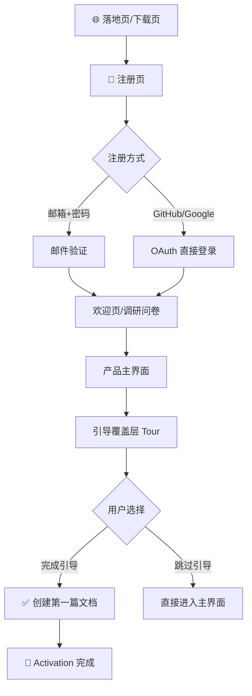

# 🚀 Onboarding 体验设计

> **📌 模板说明**: 本文档定义新用户从注册到首次激活的完整体验设计，包括引导流程、空状态、功能发现机制。AI 填写时请替换所有 `<!-- FILL -->` 占位符。

---

## 🗂️ 元数据

| 字段 | 内容 |
|------|------|
| 📦 产品名称 | <!-- FILL: 产品名 --> |
| 🔖 文档版本 | <!-- FILL: 0.1.0 --> |
| 📅 最后更新 | <!-- FILL: YYYY-MM-DD --> |

---

## 🎯 1. 核心目标

| 📊 指标 | 🎯 目标值 | 🔬 衡量方式 |
|---------|---------|------------|
| 注册完成率 | > 80% | 开始注册 → 完成注册 漏斗 |
| 首次核心功能使用率 | > 60% | 注册后 10 分钟内触发 Aha Moment |
| D7 留存率 | > 40% | 注册后第 7 天有登录行为 |
| D30 留存率 | > 20% | 注册后第 30 天有登录行为 |

> 🌟 **Aha Moment 定义**: 用户在 **10 分钟内完成第一篇文档并看到实时预览**，此时留存率显著提升。

---

## 🗺️ 2. 首次启动流程

### 2.1 注册 → 首次进入完整链路



### 2.2 🎉 欢迎页（推荐实现）

展示内容：
1. **欢迎语** — "欢迎来到 {产品名}，{用户名}！"
2. **1-3 个快速问题**（用于个性化推荐）

示例问题：

| # | 问题 | 选项 |
|---|------|------|
| 1 | 你主要用来做什么？ | ✍️ 写作创作 / 📓 个人笔记 / 📋 项目文档 / 💻 代码文档 |
| 2 | 你之前用什么工具？ | Typora / Obsidian / Notion / 其他 / 没有 |
| 3 | 你从哪里了解到我们？ | 朋友推荐 / 搜索 / 社交媒体 / 开发者社区 |

> 💡 **设计建议**: 问卷最多 3 题，全部选择题，30 秒内完成，不强制填写。

---

## 📭 3. 空状态设计

### 3.1 📄 文档列表为空

```
╔═══════════════════════════════════════╗
║                                       ║
║              📝                       ║
║                                       ║
║      你还没有任何文档                   ║
║   开始写作，或导入已有的 Markdown 文件    ║
║                                       ║
║   [+ 新建文档]       [📂 导入文件]       ║
║                                       ║
║   💡 试试模板库，快速开始第一篇文档        ║
║                                       ║
╚═══════════════════════════════════════╝
```

- 🔵 **主操作**: 「新建文档」（品牌色填充按钮）
- ⚪ **次操作**: 「导入 .md 文件」（次要按钮）
- 🔗 **探索入口**: 「浏览模板库」（文字链接）

### 3.2 🔍 搜索无结果

```
╔═══════════════════════════════════════╗
║                                       ║
║              🔍                       ║
║                                       ║
║    没有找到包含 "{关键词}" 的文档         ║
║                                       ║
║   [+ 新建文档]     [✕ 清除搜索]         ║
║                                       ║
╚═══════════════════════════════════════╝
```

### 3.3 ⭐ 收藏为空

```
还没有收藏任何文档
点击文档卡片右键菜单中的 ★ 来收藏
```

### 3.4 🏷️ 标签筛选无结果

```
该标签下暂无文档
[查看全部文档]
```

---

## 🧭 4. 引导覆盖层（Guided Tour）

> 首次进入主界面时自动触发，用户也可随时通过「帮助 → 重新引导」手动触发。

### 步骤设计

| 步骤 | 🎯 高亮区域 | 💬 提示文案 | 按钮 |
|------|-----------|------------|------|
| 1/5 | 侧边栏文件树 | 这里是你的文档库，可以创建文件夹来整理文档 | 下一步 → |
| 2/5 | 「新建文档」按钮 | 点击这里创建你的第一篇文档 | 下一步 → |
| 3/5 | 编辑区域 | 左侧用 Markdown 编写，右侧实时预览效果 | 下一步 → |
| 4/5 | 格式工具栏 | 工具栏可以快速插入标题、链接、代码块等格式 | 下一步 → |
| 5/5 | AI / 分享按钮 | 🤖 AI 辅助写作，或一键生成分享链接给他人 | 完成 🎉 |

### 引导层技术规范

```css
/* 遮罩层 */
.tour-backdrop {
  background: rgba(0, 0, 0, 0.65);
  backdrop-filter: blur(1px);
}

/* 高亮区域（透明切挖） */
.tour-highlight {
  box-shadow: 0 0 0 9999px rgba(0, 0, 0, 0.65);
  border-radius: var(--radius-md);
  outline: 2px solid var(--color-primary);
}

/* 提示卡片 */
.tour-tooltip {
  background: var(--bg-elevated);
  border: 1px solid var(--border-default);
  border-radius: var(--radius-lg);
  padding: 16px 20px;
  max-width: 320px;
  box-shadow: var(--shadow-xl);
}
```

- 📍 **提示卡片位置**: 优先在高亮元素下方，空间不足时自动上移
- 📊 **进度指示**: 右上角显示 `1/5`
- 🔘 **跳过入口**: 右上角「跳过引导」文字链接，始终可见

---

## 💡 5. 功能发现机制

### 5.1 🎯 渐进式功能曝光

| 🎬 行为触发 | 💡 曝光功能 | 📍 展示位置 |
|-----------|-----------|------------|
| 编辑 3 分钟后 | 提示「试试 Ctrl+S 保存，或开启自动保存」 | 状态栏气泡 |
| 创建第 3 篇文档 | 提示「文档多了？试试创建文件夹来整理」 | 侧边栏气泡 |
| 粘贴 > 500 字后 | 提示「试试 AI 摘要，快速提炼关键信息」 | 工具栏徽标 |
| 首次切换分屏模式 | 提示「拖动分隔线可以调整编辑/预览比例」 | 分隔线气泡 |
| 保存 10 次后 | 提示「开启自动保存，再也不担心忘记保存」 | Toast |

### 5.2 🔵 Feature Callout（新功能气泡）

新功能上线时，在相关按钮旁显示蓝色圆点 + 气泡提示：

- ⏰ 气泡显示 **3 天**
- 👆 用户点击后**永不再显示**
- 🚦 每次**最多 1 个**同时显示
- 💾 状态存储在 localStorage

---

## 🔍 6. Tooltip 引导系统

| 🔧 元素 | 💬 Tooltip 内容 | ⏰ 显示时机 |
|---------|----------------|-----------|
| 🤖 AI 按钮 | AI 辅助写作：续写、改写、摘要、翻译... | 首次 hover（3s 延迟） |
| 🔗 分享按钮 | 生成分享链接，可设置密码和有效期 | 首次 hover |
| 🏷️ 标签按钮 | 用标签分类文档，快速筛选 | 首次 hover |
| 📤 导出按钮 | 导出为 PDF、HTML 或纯 Markdown | 首次 hover |
| ⌨️ 快捷键按钮 | Ctrl+/ 查看所有快捷键 | hover |

> ⚠️ **设计原则**: 首次 hover 显示引导 Tooltip，用户操作过后不再自动弹出，转为普通功能说明 Tooltip。

---

## 📚 7. 帮助系统

### 7.1 帮助入口

- 🔘 工具栏右侧「**?**」图标按钮
- ⌨️ 快捷键 `F1` 打开帮助中心
- ⌨️ 快捷键 `Ctrl+/` 打开快捷键速查面板

### 7.2 帮助内容

- [ ] ⌨️ **快捷键速查**（Ctrl+/ 快速打开）
- [ ] 📝 **Markdown 语法速查**（GFM 常用语法）
- [ ] ❓ **常见问题 FAQ**（按分类整理）
- [ ] 🎬 **视频教程入口**（链接到 YouTube/B站）
- [ ] 💬 **联系支持**（邮件 / Discord / GitHub Issues）

### 7.3 上下文帮助

| 🏷️ 场景 | 💬 提示内容 | 📍 位置 |
|---------|-----------|---------|
| 表单输入错误 | 具体错误原因（如"邮箱格式不正确"） | 输入框下方红字 |
| 网络离线 | "当前离线，修改已保存到本地，联网后自动同步" | 顶部 Banner |
| 存储达 80% | "云端存储已使用 80%，考虑升级 Pro" | 侧边栏底部提示 |
| AI 余额不足 | "AI 使用次数已用完，升级 Pro 解锁更多" | Toast + 跳转按钮 |

---

## 📊 8. 激活漏斗

```
注册          ─────────────── 100%
              ↓
填写欢迎问卷   ─────────────── 🎯 目标 90%
              ↓
进入主界面     ─────────────── 🎯 目标 88%
              ↓
完成引导 / 跳过 ─────────────── 🎯 目标 80%
              ↓
创建第 1 篇文档 ─────────────── 🎯 目标 60%  ← Activation
              ↓
第 7 日回访    ─────────────── 🎯 目标 40%  ← D7 Retention
              ↓
第 30 日回访   ─────────────── 🎯 目标 20%  ← D30 Retention
```

> 📊 **监控建议**: 在 Posthog / Mixpanel 中为每个漏斗步骤打点事件，每周检查转化率。

---

## 📋 9. Changelog

| 🔖 版本 | 📅 日期 | 📝 变更 |
|---------|--------|---------|
| 0.1.0 | <!-- FILL: YYYY-MM-DD --> | 初始版本 |

---

> **✅ 质量检查**: ✓ 注册流程有完整流程图 ✓ 空状态设计完整（4种） ✓ 引导覆盖层规范细致 ✓ 渐进式功能发现机制 ✓ 激活漏斗可量化
