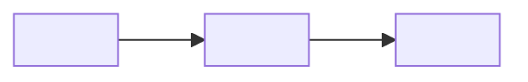

# 产品图景 (Product Vision)

> **模板说明**: 本文档定义产品的全局愿景、品牌定位、产品矩阵和商业模式。是所有其他文档的上游源头。

---

## 元数据

| 字段 | 内容 |
|------|------|
| 产品名称 | <!-- FILL: 产品名 --> |
| 版本 | <!-- FILL: v1.0 --> |
| 日期 | <!-- FILL: YYYY-MM-DD --> |
| 作者 | <!-- FILL: 作者 --> |
| 状态 | <!-- FILL: Draft / Review / Approved --> |

---

## 1. 品牌定位

### 1.1 品牌名称

<!-- FILL: 品牌名称及含义 -->

### 1.2 Slogan

<!-- FILL: 一句话定位，例如 "AI 时代的生产力工具" -->

### 1.3 品牌价值观

| # | 价值观 | 描述 |
|---|--------|------|
| 1 | <!-- FILL: 例如 效率优先 --> | <!-- FILL: 描述 --> |
| 2 | <!-- FILL: --> | <!-- FILL: --> |
| 3 | <!-- FILL: --> | <!-- FILL: --> |
| 4 | <!-- FILL: --> | <!-- FILL: --> |
| 5 | <!-- FILL: --> | <!-- FILL: --> |

### 1.4 目标用户画像

<!-- 至少定义 3 个核心用户画像 -->

#### 用户画像 1: <!-- FILL: 例如 个人开发者 -->

- **人口特征**: <!-- FILL: 年龄/职业/技术水平 -->
- **痛点**: <!-- FILL: 3-5 个核心痛点 -->
- **需求**: <!-- FILL: 他们最想要什么 -->
- **使用场景**: <!-- FILL: 在什么情况下使用 -->

#### 用户画像 2: <!-- FILL: 例如 小团队 -->

- **人口特征**: <!-- FILL -->
- **痛点**: <!-- FILL -->
- **需求**: <!-- FILL -->
- **使用场景**: <!-- FILL -->

#### 用户画像 3: <!-- FILL: 例如 企业用户 -->

- **人口特征**: <!-- FILL -->
- **痛点**: <!-- FILL -->
- **需求**: <!-- FILL -->
- **使用场景**: <!-- FILL -->

---

## 2. 产品矩阵

<!-- 列出所有产品/服务 -->

| # | 产品名 | 定位 | 状态 | 核心功能 | 技术方案 |
|---|--------|------|------|----------|----------|
| 1 | <!-- FILL --> | <!-- FILL --> | <!-- FILL: 规划中/开发中/已上线 --> | <!-- FILL --> | <!-- FILL --> |
| 2 | <!-- FILL --> | <!-- FILL --> | <!-- FILL --> | <!-- FILL --> | <!-- FILL --> |
| 3 | <!-- FILL --> | <!-- FILL --> | <!-- FILL --> | <!-- FILL --> | <!-- FILL --> |

### 2.1 产品间关系

### 2.2 用户旅程

<!-- OPTIONAL -->
<!-- 描述用户从发现到使用的完整旅程 -->

1. **发现**: <!-- FILL: 用户如何发现产品 -->
2. **注册**: <!-- FILL: 首次使用体验 -->
3. **激活**: <!-- FILL: 什么功能让用户留下来 -->
4. **付费**: <!-- FILL: 什么触发付费 -->
5. **传播**: <!-- FILL: 用户如何分享 -->

---

## 3. 商业模式

### 3.1 收入模型

| 收入来源 | 描述 | 预期占比 | 阶段 |
|----------|------|----------|------|
| <!-- FILL: 例如 订阅 --> | <!-- FILL --> | <!-- FILL: % --> | <!-- FILL: Phase 1 --> |
| <!-- FILL --> | <!-- FILL --> | <!-- FILL --> | <!-- FILL --> |
| <!-- FILL --> | <!-- FILL --> | <!-- FILL --> | <!-- FILL --> |

### 3.2 定价策略

<!-- OPTIONAL -->

| 套餐 | 价格 | 功能范围 | 目标用户 |
|------|------|----------|----------|
| <!-- FILL: Free --> | <!-- FILL --> | <!-- FILL --> | <!-- FILL --> |
| <!-- FILL: Pro --> | <!-- FILL --> | <!-- FILL --> | <!-- FILL --> |
| <!-- FILL: Team --> | <!-- FILL --> | <!-- FILL --> | <!-- FILL --> |

### 3.3 增长策略

1. <!-- FILL: 例如 产品驱动增长 PLG -->
2. <!-- FILL -->
3. <!-- FILL -->

---

## 4. 风险与挑战

| 风险类别 | 风险描述 | 影响 | 概率 | 缓解措施 |
|----------|----------|------|------|----------|
| <!-- FILL: 技术 --> | <!-- FILL --> | <!-- FILL: 高/中/低 --> | <!-- FILL --> | <!-- FILL --> |
| <!-- FILL: 市场 --> | <!-- FILL --> | <!-- FILL --> | <!-- FILL --> | <!-- FILL --> |
| <!-- FILL: 运营 --> | <!-- FILL --> | <!-- FILL --> | <!-- FILL --> | <!-- FILL --> |
| <!-- FILL: 合规 --> | <!-- FILL --> | <!-- FILL --> | <!-- FILL --> | <!-- FILL --> |

---

## 5. 成功指标

### 5.1 各阶段 KPI

| 阶段 | 时间范围 | 核心指标 | 目标值 |
|------|----------|----------|--------|
| <!-- FILL: MVP --> | <!-- FILL --> | <!-- FILL: 例如 注册用户数 --> | <!-- FILL: 10,000 --> |
| <!-- FILL: Growth --> | <!-- FILL --> | <!-- FILL --> | <!-- FILL --> |
| <!-- FILL: Mature --> | <!-- FILL --> | <!-- FILL --> | <!-- FILL --> |

---

## 6. 待决策事项

| # | 决策项 | 选项 | 倾向 | 截止时间 |
|---|--------|------|------|----------|
| 1 | <!-- FILL --> | <!-- FILL --> | <!-- FILL --> | <!-- FILL --> |
| 2 | <!-- FILL --> | <!-- FILL --> | <!-- FILL --> | <!-- FILL --> |
| 3 | <!-- FILL --> | <!-- FILL --> | <!-- FILL --> | <!-- FILL --> |

---

> **质量检查**: ✓ 品牌定位清晰 ✓ 用户画像具体 ✓ 产品矩阵完整 ✓ 商业模式可行 ✓ 风险有缓解方案
