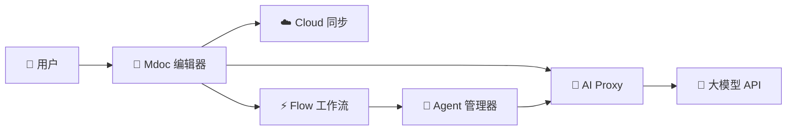

# 🌟 产品图景 (Product Vision)

> **📌 模板说明**: 本文档定义产品的全局愿景、品牌定位、产品矩阵和商业模式。是所有其他文档的上游源头，应首先完成。AI 填写时请替换所有 `<!-- FILL -->` 占位符。

---

## 🗂️ 元数据

| 字段 | 内容 |
|------|------|
| 📦 产品名称 | <!-- FILL: 产品名 --> |
| 🔖 版本 | <!-- FILL: v1.0 --> |
| 📅 日期 | <!-- FILL: YYYY-MM-DD --> |
| 👤 作者 | <!-- FILL: 作者 --> |
| 🚦 状态 | <!-- FILL: Draft / Review / Approved --> |

---

## 🏷️ 1. 品牌定位

### 1.1 品牌名称

> **<!-- FILL: 品牌名称 -->** — <!-- FILL: 品牌名称的含义和由来 -->

### 1.2 Slogan

> 🎯 **<!-- FILL: 一句话定位，例如 "AI 时代的生产力工具" -->**

### 1.3 品牌价值观

| # | 💎 价值观 | 📝 描述 |
|---|----------|---------|
| 1 | <!-- FILL: 🚀 效率优先 --> | <!-- FILL: 让每一次写作都比上次更快 --> |
| 2 | <!-- FILL: 🤖 AI 原生 --> | <!-- FILL: AI 不是插件，是核心能力 --> |
| 3 | <!-- FILL: 🔒 隐私保护 --> | <!-- FILL: 数据属于用户，不做二次利用 --> |
| 4 | <!-- FILL: 🌐 开放生态 --> | <!-- FILL: 拥抱标准，兼容主流工具链 --> |
| 5 | <!-- FILL: 👥 社区驱动 --> | <!-- FILL: 用户的声音塑造产品方向 --> |

### 1.4 目标用户画像

#### 👨‍💻 用户画像 1: <!-- FILL: 例如 独立开发者 / 技术写作者 -->

- **👤 人口特征**: <!-- FILL: 25-40岁，有技术背景，日常使用 Git/VSCode/Terminal -->
- **😤 痛点**:
  - <!-- FILL: 现有工具要么太重（Word），要么太简陋（记事本） -->
  - <!-- FILL: AI 功能与编辑器脱离，需要反复切换工具 -->
  - <!-- FILL: 多设备同步总出问题 -->
- **💡 核心需求**: <!-- FILL: 快速写作 + AI 辅助 + 无缝同步 -->
- **🎬 使用场景**: <!-- FILL: 写技术博客、API文档、项目README、读书笔记 -->

#### 🎨 用户画像 2: <!-- FILL: 例如 内容创作者 / 自媒体运营 -->

- **👤 人口特征**: <!-- FILL: 22-35岁，有内容创作经验，活跃于各平台 -->
- **😤 痛点**:
  - <!-- FILL: Markdown 排版好看，但工具界面难用 -->
  - <!-- FILL: 无法直观看到最终效果 -->
- **💡 核心需求**: <!-- FILL: 所见即所得 + 一键发布到多平台 -->
- **🎬 使用场景**: <!-- FILL: 写公众号文章、知乎专栏、掘金博客 -->

#### 🏢 用户画像 3: <!-- FILL: 例如 小团队 / 初创公司 -->

- **👤 人口特征**: <!-- FILL: 5-20人团队，需要共享知识库和项目文档 -->
- **😤 痛点**:
  - <!-- FILL: Notion 太贵，Confluence 太重 -->
  - <!-- FILL: 文档版本混乱，无法追溯变更 -->
- **💡 核心需求**: <!-- FILL: 协作编辑 + 权限管理 + 版本历史 -->
- **🎬 使用场景**: <!-- FILL: 产品文档、技术规范、会议纪要 -->

---

## 📦 2. 产品矩阵

| # | 🏷️ 产品名 | 🎯 定位 | 🚦 状态 | ⚡ 核心功能 | 🔧 技术方案 |
|---|----------|---------|---------|-------------|-------------|
| 1 | <!-- FILL: Mdoc --> | <!-- FILL: AI Markdown 编辑器 --> | <!-- FILL: 🟢 开发中 --> | <!-- FILL: 编辑/预览/AI写作/云同步 --> | <!-- FILL: React+CodeMirror+Tauri --> |
| 2 | <!-- FILL: Flow --> | <!-- FILL: 可视化工作流 --> | <!-- FILL: 🔵 规划中 --> | <!-- FILL: 拖拽编排/AI节点/自动化 --> | <!-- FILL: React Flow --> |
| 3 | <!-- FILL: Agent --> | <!-- FILL: AI Agent 管理器 --> | <!-- FILL: 🔵 规划中 --> | <!-- FILL: Agent创建/编排/监控 --> | <!-- FILL: LangChain/AutoGen --> |
| 4 | <!-- FILL: AI Proxy --> | <!-- FILL: 大模型API代理 --> | <!-- FILL: 🔵 规划中 --> | <!-- FILL: 统一API网关/计费/限流 --> | <!-- FILL: Node.js/Nginx --> |
| 5 | <!-- FILL: Cloud --> | <!-- FILL: 云服务基础设施 --> | <!-- FILL: 🟡 搭建中 --> | <!-- FILL: 存储/认证/实时同步 --> | <!-- FILL: Supabase自托管 --> |

### 2.1 产品间关系

### 2.2 用户旅程

| 阶段 | 🎬 行为 | 💡 触点 |
|------|---------|---------|
| 🔍 **发现** | <!-- FILL: 通过搜索/推荐/社群了解产品 --> | <!-- FILL: SEO / 开发者社区 / 口碑 --> |
| 📝 **注册** | <!-- FILL: 5分钟完成注册，立即开始编辑 --> | <!-- FILL: 简洁的 onboarding 流程 --> |
| ⚡ **激活** | <!-- FILL: 第一次用 AI 功能时"哇"的时刻 --> | <!-- FILL: 首次使用 AI 续写/改写 --> |
| 💳 **付费** | <!-- FILL: 超出免费额度，需要更多 AI 配额 --> | <!-- FILL: 付费墙 + 明确的价值感知 --> |
| 📢 **传播** | <!-- FILL: 分享精美文档/推荐给团队 --> | <!-- FILL: 分享链接 / 嵌入展示 --> |

---

## 💰 3. 商业模式

### 3.1 收入模型

| 💵 收入来源 | 📝 描述 | 📊 预期占比 | 🗓️ 阶段 |
|-------------|---------|-------------|---------|
| <!-- FILL: 订阅（Pro/Team） --> | <!-- FILL: 月/年订阅，解锁 AI 额度和高级功能 --> | <!-- FILL: 70% --> | <!-- FILL: Phase 2 --> |
| <!-- FILL: AI 用量计费 --> | <!-- FILL: 超出免费 Token 后按量付费 --> | <!-- FILL: 20% --> | <!-- FILL: Phase 2 --> |
| <!-- FILL: 私有化部署 --> | <!-- FILL: 企业版一次性授权 + 年维护 --> | <!-- FILL: 10% --> | <!-- FILL: Phase 3 --> |

### 3.2 定价策略

| 套餐 | 💰 价格 | 📋 功能范围 | 👥 目标用户 |
|------|---------|-------------|-------------|
| 🆓 Free | 永久免费 | <!-- FILL: 本地编辑 + 基础同步 + 10次/天AI --> | 个人用户/学生 |
| ⭐ Pro | <!-- FILL: ¥29/月 或 ¥199/年 --> | <!-- FILL: 无限AI + 高级导出 + 优先支持 --> | 专业用户 |
| 👥 Team | <!-- FILL: ¥99/月（5人） --> | <!-- FILL: 协作编辑 + 团队空间 + 管理后台 --> | 小团队 |
| 🏢 Enterprise | <!-- FILL: 定制报价 --> | <!-- FILL: 私有化部署 + SLA + 专属支持 --> | 企业 |

### 3.3 增长策略

1. 🚀 **产品驱动增长 (PLG)** — <!-- FILL: 免费版足够好用，口碑传播 -->
2. 📢 **开发者社区** — <!-- FILL: GitHub开源核心功能，吸引技术用户 -->
3. 🤝 **内容营销** — <!-- FILL: 博客/视频教程，SEO引流 -->
4. 🎁 **推荐奖励** — <!-- FILL: 邀请朋友获得额外 AI 配额 -->

---

## ⚠️ 4. 风险与挑战

| 🏷️ 风险类别 | 📝 风险描述 | ⚡ 影响 | 📊 概率 | 🛡️ 缓解措施 |
|-------------|-------------|---------|---------|-------------|
| 🔧 技术 | <!-- FILL: AI API成本超预期 --> | 高 | 中 | <!-- FILL: 本地模型备选 + 用量限制 --> |
| 🏪 市场 | <!-- FILL: 竞品（Obsidian/Notion）跟进AI功能 --> | 高 | 高 | <!-- FILL: 差异化功能 + 社区护城河 --> |
| 👥 运营 | <!-- FILL: 团队规模小，功能迭代慢 --> | 中 | 高 | <!-- FILL: MVP聚焦 + 社区贡献者 --> |
| ⚖️ 合规 | <!-- FILL: AI生成内容的版权和责任问题 --> | 中 | 低 | <!-- FILL: 明确用户协议 + 内容审核 --> |

---

## 📊 5. 成功指标

### 各阶段 KPI

| 🗓️ 阶段 | ⏱️ 时间范围 | 📈 核心指标 | 🎯 目标值 |
|---------|-------------|-------------|-----------|
| <!-- FILL: MVP --> | <!-- FILL: 月1-3 --> | <!-- FILL: 注册用户数 / DAU / Retention D7 --> | <!-- FILL: 1万注册 / 500 DAU / 30% --> |
| <!-- FILL: Growth --> | <!-- FILL: 月4-9 --> | <!-- FILL: MRR / 付费转化率 / NPS --> | <!-- FILL: ¥3万 MRR / 5% 转化 / NPS > 50 --> |
| <!-- FILL: Scale --> | <!-- FILL: 月10-18 --> | <!-- FILL: 总用户数 / ARR / 企业客户数 --> | <!-- FILL: 10万用户 / ¥100万 ARR / 10家 --> |

---

## 🤔 6. 待决策事项

| # | ❓ 决策项 | 🔀 选项 | 💭 倾向 | ⏰ 截止 |
|---|----------|---------|---------|---------|
| 1 | <!-- FILL: 是否开源核心编辑器？ --> | <!-- FILL: 完全开源 / 核心开源+商业插件 / 闭源 --> | <!-- FILL: 核心开源 --> | <!-- FILL: --> |
| 2 | <!-- FILL: 移动端方案？ --> | <!-- FILL: PWA / Capacitor / 原生 --> | <!-- FILL: PWA优先 --> | <!-- FILL: --> |
| 3 | <!-- FILL: 社区平台选择？ --> | <!-- FILL: Discord / 微信群 / GitHub Discussions --> | <!-- FILL: Discord + 微信 --> | <!-- FILL: --> |

---

> **✅ 质量检查**: ✓ 品牌定位清晰有力 ✓ 用户画像具体可感知 ✓ 产品矩阵完整 ✓ 商业模式可行 ✓ 风险有缓解方案 ✓ KPI 可量化
