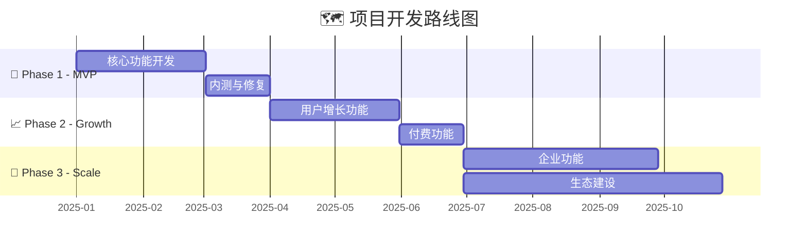
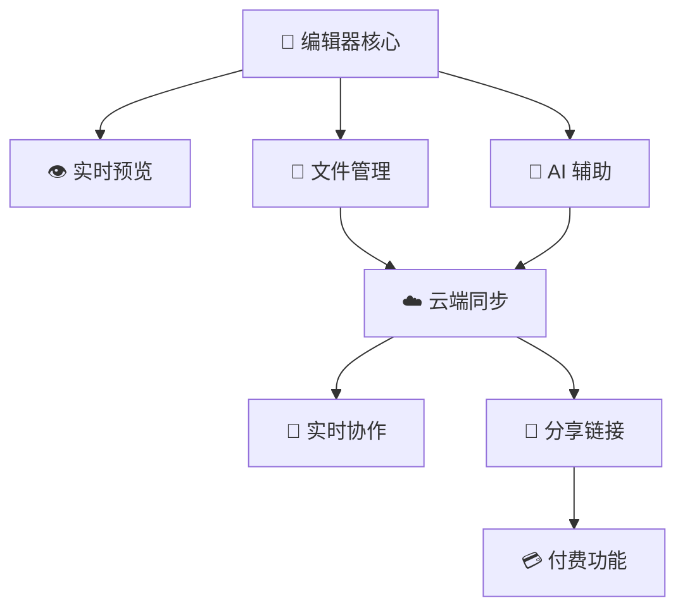

# 🗺️ 开发路线图 (Roadmap)

> **📌 模板说明**: 本文档定义产品开发的分阶段计划、里程碑和优先级。是项目管理的核心参考文档。AI 填写时请替换所有 `<!-- FILL -->` 占位符。

---

## 🗂️ 元数据

| 字段 | 内容 |
|------|------|
| 📦 产品名称 | <!-- FILL: 产品名 --> |
| 🔖 版本 | <!-- FILL: v1.0 --> |
| 📅 日期 | <!-- FILL: YYYY-MM-DD --> |
| 👤 作者 | <!-- FILL --> |
| 🚦 状态 | <!-- FILL: Draft / Review / Approved --> |

---

## ⏱️ 1. 全局时间线



---

## 🎯 2. 优先级矩阵

```
                    📈 高价值
                       │
         ┌─────────────┼─────────────┐
         │  🟡 P1      │  🔴 P0      │
         │  快速胜出   │  核心必做   │
  低难度 ├─────────────┼─────────────┤ 高难度
         │  🟢 P2      │  🟡 P1      │
         │  机会窗口   │  计划投入   │
         └─────────────┼─────────────┘
                       │
                    📉 低价值
```

### 优先级定义

| 🏷️ 优先级 | 📝 定义 | 🎯 决策规则 |
|----------|---------|-------------|
| 🔴 **P0** | 必须做 | 缺少则产品无法上线，阻塞发布 |
| 🟡 **P1** | 应该做 | 显著提升用户体验或竞争力 |
| 🟢 **P2** | 可以做 | 锦上添花，资源允许时做 |

---

## 🚀 3. 各阶段里程碑

### Phase 1: <!-- FILL: MVP 核心功能 --> `<!-- FILL: 2025-01 ~ 2025-03 -->`

> **目标**: <!-- FILL: 打造可用的核心编辑体验，完成 MVP 发布，开始种子用户招募 -->

| # | ✨ 功能 | 🏷️ 优先级 | ⏱️ 预估工时 | 📦 交付物 | ✅ 验收标准 |
|---|---------|-----------|-------------|-----------|-------------|
| 1 | <!-- FILL: Markdown 编辑器 --> | 🔴 P0 | <!-- FILL: 2周 --> | <!-- FILL: CodeMirror 编辑器组件 --> | <!-- FILL: GFM语法全支持，延迟<16ms --> |
| 2 | <!-- FILL: 实时预览 --> | 🔴 P0 | <!-- FILL: 1周 --> | <!-- FILL: 分栏预览面板 --> | <!-- FILL: 同步滚动，300ms内渲染 --> |
| 3 | <!-- FILL: 文件管理 --> | 🔴 P0 | <!-- FILL: 1周 --> | <!-- FILL: 侧边栏文件树 --> | <!-- FILL: CRUD操作全正常 --> |
| 4 | <!-- FILL: 本地存储 --> | 🔴 P0 | <!-- FILL: 3天 --> | <!-- FILL: localStorage持久化 --> | <!-- FILL: 刷新不丢数据 --> |
| 5 | <!-- FILL: 导出功能 --> | 🟡 P1 | <!-- FILL: 1周 --> | <!-- FILL: PDF/HTML导出 --> | <!-- FILL: 格式保真>95% --> |

> 🏁 **里程碑**: <!-- FILL: "可公开测试的 MVP 版本，完成产品核心交互闭环" -->

---

### Phase 2: <!-- FILL: 用户增长 --> `<!-- FILL: 2025-04 ~ 2025-06 -->`

> **目标**: <!-- FILL: 引入 AI 功能和云端同步，提升用户留存，开始商业化探索 -->

| # | ✨ 功能 | 🏷️ 优先级 | ⏱️ 预估工时 | 📦 交付物 | ✅ 验收标准 |
|---|---------|-----------|-------------|-----------|-------------|
| 1 | <!-- FILL: 云端同步 --> | 🟡 P1 | <!-- FILL: 2周 --> | <!-- FILL: Supabase 同步服务 --> | <!-- FILL: 同步延迟<2s，冲突处理正确 --> |
| 2 | <!-- FILL: AI 辅助写作 --> | 🟡 P1 | <!-- FILL: 2周 --> | <!-- FILL: AI 侧边栏面板 --> | <!-- FILL: 续写/改写/摘要功能可用 --> |
| 3 | <!-- FILL: 分享链接 --> | 🟡 P1 | <!-- FILL: 1周 --> | <!-- FILL: 只读分享页 --> | <!-- FILL: 链接可访问，支持密码保护 --> |
| 4 | <!-- FILL: 付费功能 --> | 🟡 P1 | <!-- FILL: 1周 --> | <!-- FILL: 订阅系统 --> | <!-- FILL: 支付流程完整，降级处理正确 --> |

> 🏁 **里程碑**: <!-- FILL: "用户 D30 留存 > 20%，MRR 达到 ¥5000+" -->

---

### Phase 3: <!-- FILL: 规模化扩张 --> `<!-- FILL: 2025-07 ~ 2025-12 -->`

> **目标**: <!-- FILL: 拓展协作和企业功能，建立生态，冲击10万用户目标 -->

| # | ✨ 功能 | 🏷️ 优先级 | ⏱️ 预估工时 | 📦 交付物 | ✅ 验收标准 |
|---|---------|-----------|-------------|-----------|-------------|
| 1 | <!-- FILL: 实时协作 --> | 🟡 P1 | <!-- FILL: 4周 --> | <!-- FILL: Yjs CRDT 协作 --> | <!-- FILL: 多人编辑无冲突 --> |
| 2 | <!-- FILL: 知识图谱 --> | 🟢 P2 | <!-- FILL: 3周 --> | <!-- FILL: 双向链接 + 关系图 --> | <!-- FILL: 链接正确，图谱实时更新 --> |
| 3 | <!-- FILL: 桌面客户端 --> | 🟢 P2 | <!-- FILL: 4周 --> | <!-- FILL: Tauri 打包 --> | <!-- FILL: 离线可用，本地文件访问 --> |

> 🏁 **里程碑**: <!-- FILL: "总注册用户 10万+，ARR 达到 ¥100万" -->

---

## 🔗 4. 依赖关系



| ✨ 功能 | 🔗 依赖 | ⚡ 阻塞 |
|---------|---------|---------|
| <!-- FILL: 云端同步 --> | <!-- FILL: 用户认证系统 --> | <!-- FILL: 实时协作、分享链接 --> |
| <!-- FILL: AI 辅助 --> | <!-- FILL: 编辑器API + AI Proxy --> | <!-- FILL: 无 --> |
| <!-- FILL: 实时协作 --> | <!-- FILL: 云端同步 + WebSocket --> | <!-- FILL: 无 --> |

---

## 👥 5. 资源规划

### 5.1 人力需求

| 👤 角色 | 🚀 Phase 1 | 📈 Phase 2 | 🏢 Phase 3 |
|---------|-----------|-----------|-----------|
| 前端开发 | <!-- FILL: 2人 --> | <!-- FILL: 2人 --> | <!-- FILL: 3人 --> |
| 后端开发 | <!-- FILL: 1人 --> | <!-- FILL: 2人 --> | <!-- FILL: 3人 --> |
| UI/UX 设计 | <!-- FILL: 1人 (兼职) --> | <!-- FILL: 1人 --> | <!-- FILL: 2人 --> |
| 产品经理 | <!-- FILL: 1人 --> | <!-- FILL: 1人 --> | <!-- FILL: 2人 --> |

### 5.2 预算估算

| 💸 类别 | 🚀 Phase 1/月 | 📈 Phase 2/月 | 🏢 Phase 3/月 |
|---------|-------------|-------------|-------------|
| 云服务器 | <!-- FILL: ¥500 --> | <!-- FILL: ¥2000 --> | <!-- FILL: ¥8000 --> |
| AI API 费用 | <!-- FILL: ¥200 --> | <!-- FILL: ¥2000 --> | <!-- FILL: ¥10000 --> |
| 工具/服务 | <!-- FILL: ¥300 --> | <!-- FILL: ¥500 --> | <!-- FILL: ¥1000 --> |
| **💰 合计** | **<!-- FILL: ¥1000/月 -->** | **<!-- FILL: ¥4500/月 -->** | **<!-- FILL: ¥19000/月 -->** |

---

## 📋 6. 风险追踪

| ⚠️ 风险 | 📊 概率 | ⚡ 影响 | 🛡️ 缓解措施 | 🚦 状态 |
|---------|---------|---------|-------------|---------|
| <!-- FILL: 进度延误 --> | 高 | 高 | <!-- FILL: 精简 MVP 范围，优先 P0 功能 --> | 🟡 关注 |
| <!-- FILL: AI成本超支 --> | 中 | 中 | <!-- FILL: 用量限制 + 本地模型备选 --> | 🟢 正常 |
| <!-- FILL: 竞品跟进 --> | 高 | 中 | <!-- FILL: 加快迭代，强化差异化 --> | 🟡 关注 |

---

> **✅ 质量检查**: ✓ 时间线合理且有甘特图 ✓ 优先级清晰（P0/P1/P2）✓ 里程碑可验收 ✓ 依赖关系明确 ✓ 资源规划可行
