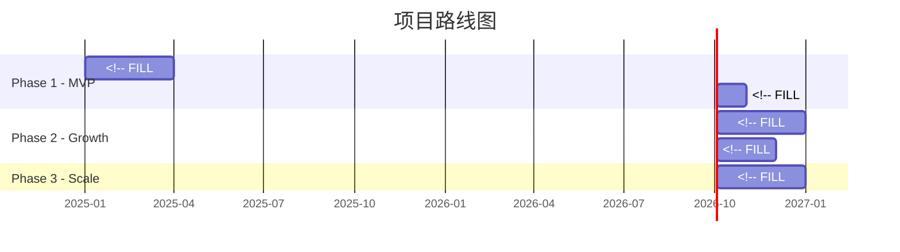
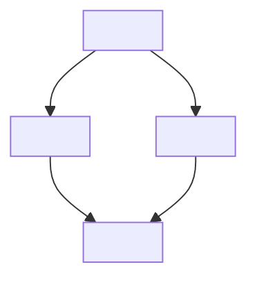

# 开发路线图 (Roadmap)

> **模板说明**: 本文档定义产品开发的分阶段计划、里程碑和优先级。是项目管理的核心参考文档。

---

## 元数据

| 字段 | 内容 |
|------|------|
| 产品名称 | <!-- FILL: 产品名 --> |
| 版本 | <!-- FILL: v1.0 --> |
| 日期 | <!-- FILL: YYYY-MM-DD --> |
| 作者 | <!-- FILL --> |
| 状态 | <!-- FILL: Draft / Review / Approved --> |

---

## 1. 全局时间线



<!-- 如果不用 Mermaid，可用 ASCII 时间线替代 -->

---

## 2. 优先级矩阵

<!-- 价值 vs 难度四象限 -->

```
            高价值
              │
   ┌──────────┼──────────┐
   │  P1:快速 │  P0:核心 │
   │  胜出    │  必做    │
低 ├──────────┼──────────┤ 高
难 │  P2:观望 │  P1:计划 │
度 │          │  投入    │
   └──────────┼──────────┘
              │
            低价值
```

### 优先级说明

| 优先级 | 定义 | 决策规则 |
|--------|------|----------|
| **P0** | 必须做 | 缺少则产品无法上线 |
| **P1** | 应该做 | 显著提升用户体验或竞争力 |
| **P2** | 可以做 | 锦上添花，资源允许时做 |

---

## 3. 各阶段里程碑

### Phase 1: <!-- FILL: 例如 MVP --> <!-- FILL: 时间范围 -->

**目标**: <!-- FILL: 一句话描述本阶段目标 -->

| # | 功能 | 优先级 | 预估工时 | 交付物 | 验收标准 |
|---|------|--------|----------|--------|----------|
| 1 | <!-- FILL --> | P0 | <!-- FILL --> | <!-- FILL --> | <!-- FILL --> |
| 2 | <!-- FILL --> | P0 | <!-- FILL --> | <!-- FILL --> | <!-- FILL --> |
| 3 | <!-- FILL --> | P1 | <!-- FILL --> | <!-- FILL --> | <!-- FILL --> |
| 4 | <!-- FILL --> | P2 | <!-- FILL --> | <!-- FILL --> | <!-- FILL --> |

**里程碑**: <!-- FILL: 例如 "可公开测试的 MVP 版本" -->

---

### Phase 2: <!-- FILL: 例如 Growth --> <!-- FILL: 时间范围 -->

**目标**: <!-- FILL -->

| # | 功能 | 优先级 | 预估工时 | 交付物 | 验收标准 |
|---|------|--------|----------|--------|----------|
| 1 | <!-- FILL --> | P1 | <!-- FILL --> | <!-- FILL --> | <!-- FILL --> |
| 2 | <!-- FILL --> | P1 | <!-- FILL --> | <!-- FILL --> | <!-- FILL --> |

**里程碑**: <!-- FILL -->

---

### Phase 3: <!-- FILL: 例如 Scale --> <!-- FILL: 时间范围 -->

**目标**: <!-- FILL -->

| # | 功能 | 优先级 | 预估工时 | 交付物 | 验收标准 |
|---|------|--------|----------|--------|----------|
| 1 | <!-- FILL --> | P2 | <!-- FILL --> | <!-- FILL --> | <!-- FILL --> |

**里程碑**: <!-- FILL -->

---

<!-- OPTIONAL: 更多 Phase -->

---

## 4. 依赖关系



| 功能 | 依赖 | 阻塞 |
|------|------|------|
| <!-- FILL --> | <!-- FILL --> | <!-- FILL --> |
| <!-- FILL --> | <!-- FILL --> | <!-- FILL --> |

---

## 5. 资源规划

### 5.1 人力需求

| 角色 | Phase 1 | Phase 2 | Phase 3 |
|------|---------|---------|---------|
| <!-- FILL: 前端 --> | <!-- FILL: 人数 --> | <!-- FILL --> | <!-- FILL --> |
| <!-- FILL: 后端 --> | <!-- FILL --> | <!-- FILL --> | <!-- FILL --> |
| <!-- FILL: 设计 --> | <!-- FILL --> | <!-- FILL --> | <!-- FILL --> |
| <!-- FILL: 产品 --> | <!-- FILL --> | <!-- FILL --> | <!-- FILL --> |

### 5.2 预算估算

<!-- OPTIONAL -->

| 类别 | Phase 1 | Phase 2 | Phase 3 |
|------|---------|---------|---------|
| <!-- FILL: 服务器 --> | <!-- FILL: ¥/月 --> | <!-- FILL --> | <!-- FILL --> |
| <!-- FILL: 第三方API --> | <!-- FILL --> | <!-- FILL --> | <!-- FILL --> |
| <!-- FILL: 工具/服务 --> | <!-- FILL --> | <!-- FILL --> | <!-- FILL --> |
| **合计** | **<!-- FILL -->** | **<!-- FILL -->** | **<!-- FILL -->** |

---

> **质量检查**: ✓ 时间线合理 ✓ 优先级清晰 ✓ 里程碑可验收 ✓ 依赖关系明确 ✓ 资源可行
