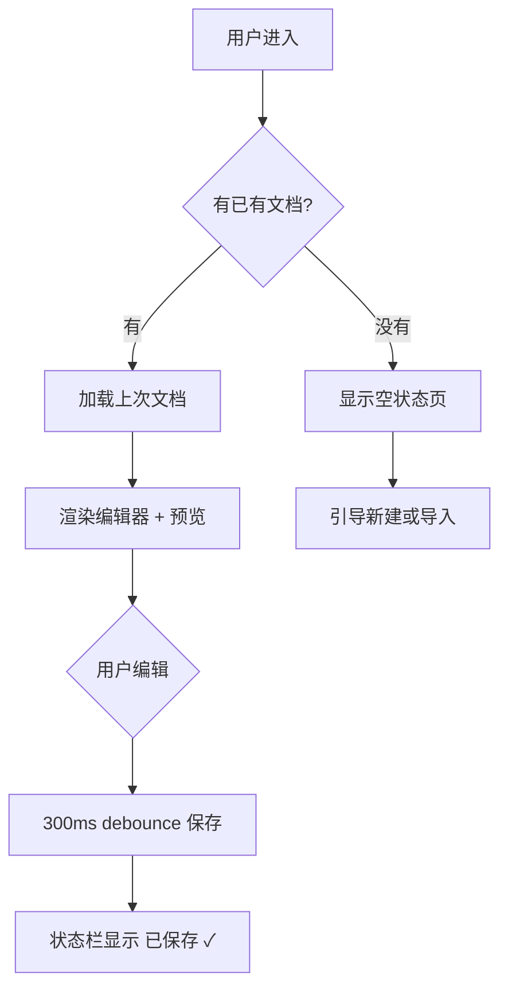

# 🖥️ UI 交互规范 (UI Specification)

> **📌 模板说明**: 本文档定义每个页面的交互流程、状态变化和响应式行为。是前后端开发的桥梁文档。AI 填写时请替换所有 `<!-- FILL -->` 占位符。

---

## 🗂️ 元数据

| 字段 | 内容 |
|------|------|
| 📦 产品名称 | <!-- FILL --> |
| 🔖 版本 | <!-- FILL --> |
| 📅 日期 | <!-- FILL: YYYY-MM-DD --> |
| 👤 作者 | <!-- FILL --> |

---

## 🌐 1. 全局交互

### 1.1 ⏳ 页面加载

| 🏷️ 阶段 | 🎬 行为 | 👁️ 展示 |
|---------|---------|---------|
| 初始加载 | 显示骨架屏，防止布局抖动 | 侧边栏骨架 + 编辑区骨架 |
| 加载完成 | 淡入实际内容（200ms opacity 过渡） | 内容替换骨架屏 |
| 加载失败 | 显示错误图标 + 友好提示 + 重试按钮 | 居中错误卡片 |
| 网络离线 | 顶部黄色 banner 提示 | "当前离线，修改将在连接后同步" |

### 1.2 ⌨️ 全局快捷键

| 快捷键 | 🎯 功能 | 📝 说明 |
|--------|---------|---------|
| `Ctrl+S` | 保存 | 强制立即保存当前文档 |
| `Ctrl+P` | 切换预览 | 仅预览 / 分栏 / 仅编辑 |
| `Ctrl+Shift+B` | 切换侧边栏 | 展开/折叠左侧文件树 |
| `Ctrl+,` | 打开设置 | 打开设置面板弹窗 |
| `Ctrl+/` | 快捷键面板 | 显示所有快捷键速查 |
| `Ctrl+B` | **加粗** | 选中文字后加粗 |
| `Ctrl+I` | *斜体* | 选中文字后斜体 |
| `Ctrl+K` | 链接 | 插入 Markdown 链接 |
| `Ctrl+O` | 导入文件 | 选择本地 .md 文件导入 |
| `Esc` | 关闭弹窗 | 关闭所有模态框/面板 |
| <!-- FILL --> | <!-- FILL --> | <!-- FILL --> |

### 1.3 📣 通知系统 (Toast)

| 🏷️ 类型 | 🎨 颜色 | 图标 | ⏱️ 自动关闭 | 场景 |
|---------|---------|------|------------|------|
| ✅ Success | 绿色 (#3FB950) | ✓ | 3s | 保存成功、创建完成 |
| ❌ Error | 红色 (#FF7B72) | ✕ | 5s（可手动关闭） | 操作失败、网络错误 |
| ⚠️ Warning | 黄色 (#E3B341) | ⚠ | 4s | 删除提醒、配置缺失 |
| ℹ️ Info | 蓝色 (#58A6FF) | ℹ | 3s | 功能提示、状态说明 |

> **位置**: 右上角叠加显示，最多同时显示 3 条

---

## 📄 2. 页面交互详情

### 2.1 ✏️ 编辑器主界面

**URL**: `<!-- FILL: / -->`  
**布局**: 左侧边栏（240px）+ 中间编辑区 + 右侧预览区（分栏模式）

#### 🔄 交互流程



#### 🔘 组件状态

| 🔧 组件 | Default | Hover | Active | Focus | Disabled | Loading |
|---------|---------|-------|--------|-------|----------|---------|
| 主按钮 | 品牌色背景 | 加深 8% + 阴影 | scale(0.98) | 2px 焦点环 | 灰色 50% | Spinner 替换文字 |
| 次要按钮 | 透明 + 边框 | 轻微背景填充 | scale(0.98) | 焦点环 | 透明度 0.5 | Spinner |
| 图标按钮 | 透明 | 圆形背景 | 加深 | 焦点环 | 透明度 0.4 | - |
| 输入框 | 边框默认色 | 边框加深 | - | 品牌色边框 | 灰底只读 | - |
| 文档列表项 | 透明背景 | 轻微背景 | 品牌色左边框 | - | - | - |

#### 📱 响应式行为

| 📐 断点 | 🔄 布局变化 | 👁️ 隐藏元素 | 🔀 替代方案 |
|---------|-----------|------------|------------|
| ≤ 1024px | 侧边栏变窄 240px | 部分状态栏文字 | 简化显示 |
| ≤ 768px | 侧边栏变 fixed 覆盖层 | 分栏模式 | 纯编辑模式 + 汉堡菜单 |
| ≤ 480px | 工具栏精简 | 全屏/快捷键/导入按钮 | 仅保留核心操作 |

---

### 2.2 ⚙️ 设置面板

**触发**: `Ctrl+,` 或工具栏齿轮图标  
**布局**: 居中弹窗，最大宽度 480px，3 个设置区块

#### 🔄 设置区块

| 🗂️ 区块 | 📋 设置项 | 🎨 控件类型 |
|---------|---------|------------|
| ✏️ 编辑器 | 字体大小 (12-24px)、行高 (1.2-2.5)、Tab 大小 (2/4) | Slider / Select |
| ✏️ 编辑器 | 显示行号、自动换行 | Toggle |
| 💾 保存 | 自动保存开关、保存间隔 (0.5-10s) | Toggle / Slider |
| 🎨 外观 | 深色/浅色主题 | Radio 图标选择 |

---

### 2.3 🤖 AI 写作面板

**触发**: 工具栏 AI 图标 或 `Ctrl+Shift+A`  
**布局**: 右侧抽屉面板，宽度 360px

#### AI 工具列表

| 🏷️ 功能 | 📝 描述 | 输入 |
|---------|---------|------|
| ✍️ 续写 | 基于当前内容继续写作 | 当前文档内容 |
| 🔄 改写 | 改变语气/风格重新表达 | 选中文字 |
| 📋 摘要 | 提炼核心要点 | 选中文字/整篇文档 |
| 📑 大纲 | 生成文档结构大纲 | 当前标题结构 |
| 🔍 校对 | 检查语法和拼写 | 选中文字 |
| 🌐 翻译 | 中英互译 | 选中文字 |
| 💬 对话 | 自由提问 AI | 自定义输入 |

---

### 2.4 🔗 分享弹窗

**触发**: 工具栏分享图标  
**布局**: 居中弹窗，宽度 420px

#### 分享配置项

| 🏷️ 选项 | 📝 描述 | 默认值 |
|---------|---------|--------|
| 🔗 分享链接 | 自动生成唯一 URL | 自动生成 |
| 🔒 密码保护 | 可选设置访问密码 | 关闭 |
| ⏰ 有效期 | 永久 / 7天 / 30天 | 永久 |
| 👁️ 浏览次数限制 | 可选设置最大访问次数 | 无限制 |

---

## 🎭 3. 微交互规范

### 3.1 🖱️ 按钮反馈

| 🎬 操作 | 👁️ 视觉反馈 | ⏱️ 时长 |
|--------|-----------|---------|
| Hover | 背景色加深 8% + cursor:pointer | 150ms |
| Click/Mousedown | scale(0.98) | 80ms |
| Mouseup | 弹回 scale(1.0) | 120ms |
| Disabled 点击 | 无反应，cursor:not-allowed | - |
| Loading | 文字替换为 Spinner | 立即 |

### 3.2 📝 表单验证

| ⏰ 触发时机 | ✅ 验证内容 | 🎨 反馈方式 |
|-----------|-----------|------------|
| 实时输入 | 格式校验（邮箱/密码强度） | 输入框右侧图标变化 |
| 失焦 (blur) | 必填/格式完整性 | 红色边框 + 下方错误文字 |
| 提交时 | 全量校验 | 滚动到第一个错误字段 |

### 3.3 ⏳ 加载状态

| 🏷️ 场景 | 💡 加载方案 | 🦴 骨架屏元素 |
|---------|-----------|--------------|
| 首次进入 | 骨架屏（Shimmer 动画） | 侧边栏列表 + 编辑区文字行 |
| 列表刷新 | 骨架行 + 原内容保留 | 5 行条目骨架 |
| AI 生成 | 流式输出（打字机效果） | - |
| 弹窗内容 | 小 Spinner 居中 | - |
| 图片/附件 | 渐进式加载 | 灰色占位块 |

---

## 🌊 4. 滚动与动画

| 🏷️ 动画类型 | 🎬 触发条件 | ✨ 效果 | ⏱️ 时长 |
|------------|-----------|---------|---------|
| 页面首屏 | 加载完成 | 内容从下方 20px 滑入 + 淡入 | 400ms |
| 侧边栏展开 | 按钮点击 | 宽度从 0→240px + 淡入 | 250ms |
| 弹窗入场 | 打开触发 | scale(0.95→1) + opacity(0→1) | 200ms |
| 弹窗退场 | 关闭触发 | scale(1→0.95) + opacity(1→0) | 150ms |
| Toast 入场 | 通知触发 | 从右侧滑入 | 300ms |
| Toast 退场 | 超时/关闭 | 向右滑出 + 淡出 | 200ms |
| 同步滚动 | 编辑区滚动 | 预览区等比例跟随 | 50ms 防抖 |

---

## 🔍 5. SEO Meta 标签

```html
<!-- 每个页面的 Meta 标签模板 -->
<title><!-- FILL: {页面名} - {产品名} --></title>
<meta name="description" content="<!-- FILL: 页面描述，120字以内 -->">
<meta name="keywords" content="<!-- FILL: Markdown, AI写作, 编辑器 -->">

<!-- Open Graph（社交分享）-->
<meta property="og:title" content="<!-- FILL -->">
<meta property="og:description" content="<!-- FILL -->">
<meta property="og:image" content="<!-- FILL: OG 图片 URL，1200x630px -->">
<meta property="og:type" content="website">

<!-- Twitter Card -->
<meta name="twitter:card" content="summary_large_image">
<meta name="twitter:title" content="<!-- FILL -->">
```

---

## 📊 6. 性能目标

| 📈 指标 | 🎯 目标值 | 🔬 测量工具 |
|---------|---------|------------|
| FCP（首次内容绘制） | < 1.5s | Lighthouse |
| LCP（最大内容绘制） | < 2.5s | Lighthouse |
| CLS（布局偏移） | < 0.1 | Lighthouse |
| TTI（可交互时间） | < 3.0s | Lighthouse |
| Bundle Size | < 200KB gzipped | Bundle Analyzer |
| 编辑器延迟 | < 16ms | Chrome Profiler |

---

> **✅ 质量检查**: ✓ 每个页面有完整交互流程图 ✓ 组件状态完整（6种）✓ 响应式断点明确 ✓ 性能目标可量化 ✓ 微交互规范细致
