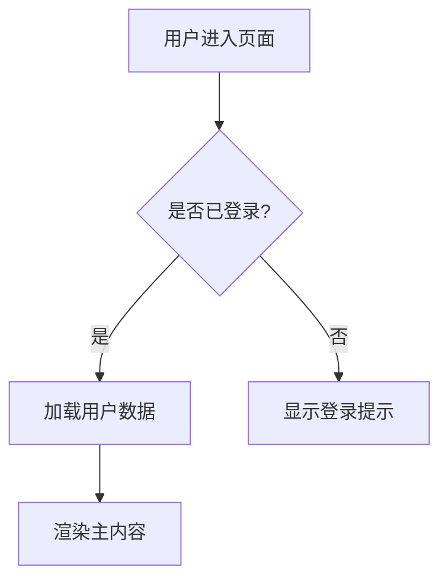

# UI 交互规范 (UI Specification)

> **模板说明**: 本文档定义每个页面的交互流程、状态变化和响应式行为。是前后端开发的桥梁文档。

---

## 元数据

| 字段 | 内容 |
|------|------|
| 产品名称 | <!-- FILL --> |
| 版本 | <!-- FILL --> |
| 日期 | <!-- FILL: YYYY-MM-DD --> |
| 作者 | <!-- FILL --> |

---

## 1. 全局交互

### 1.1 页面加载

| 阶段 | 行为 | 展示 |
|------|------|------|
| 初始加载 | <!-- FILL: 例如 显示骨架屏 --> | <!-- FILL --> |
| 加载完成 | <!-- FILL: 淡入内容 --> | <!-- FILL --> |
| 加载失败 | <!-- FILL: 错误提示 + 重试按钮 --> | <!-- FILL --> |

### 1.2 全局导航

<!-- FILL: 页面间导航方式 -->

### 1.3 全局快捷键

| 快捷键 | 功能 |
|--------|------|
| <!-- FILL: Ctrl+S --> | <!-- FILL: 保存 --> |
| <!-- FILL: Ctrl+P --> | <!-- FILL: 快速搜索 --> |
| <!-- FILL: Ctrl+/> --> | <!-- FILL: 快捷键面板 --> |

---

## 2. 页面交互

### 2.1 <!-- FILL: 页面A名称 -->

**URL**: `<!-- FILL: /path -->`
**布局**: <!-- FILL: 例如 左右分栏 -->

#### 交互流程



#### 组件状态

| 组件 | Default | Hover | Active | Focus | Disabled | Loading |
|------|---------|-------|--------|-------|----------|---------|
| <!-- FILL: 主按钮 --> | <!-- FILL: 品牌色背景 --> | <!-- FILL: 加深5% --> | <!-- FILL: 缩小2px --> | <!-- FILL: 焦点环 --> | <!-- FILL: 灰色50% --> | <!-- FILL: Spinner --> |

#### 响应式行为

| 断点 | 布局变化 | 隐藏元素 | 替代方案 |
|------|----------|----------|----------|
| <!-- FILL: ≤768px --> | <!-- FILL: 单栏 --> | <!-- FILL: 侧边栏收起 --> | <!-- FILL: 汉堡菜单 --> |

---

### 2.2 <!-- FILL: 页面B名称 -->

**URL**: `<!-- FILL: /path -->`
**布局**: <!-- FILL -->

#### 交互流程

<!-- FILL: 同上结构 -->

#### 组件状态

<!-- FILL: 同上结构 -->

#### 响应式行为

<!-- FILL: 同上结构 -->

---

<!-- OPTIONAL: 更多页面，按上述结构添加 -->

---

## 3. 微交互规范

### 3.1 按钮反馈

| 操作 | 视觉反馈 | 时长 |
|------|----------|------|
| <!-- FILL: Hover --> | <!-- FILL: 背景色加深 + cursor:pointer --> | <!-- FILL: 150ms --> |
| <!-- FILL: Click --> | <!-- FILL: 缩小到 98% + 弹回 --> | <!-- FILL: 100ms --> |
| <!-- FILL: Disabled点击 --> | <!-- FILL: 无反应 + 微震动(可选) --> | - |

### 3.2 表单验证

| 触发时机 | 验证内容 | 反馈方式 |
|----------|----------|----------|
| <!-- FILL: 输入时 --> | <!-- FILL: 格式校验 --> | <!-- FILL: 输入框红色边框 + 错误提示 --> |
| <!-- FILL: 失焦时 --> | <!-- FILL: 必填校验 --> | <!-- FILL: 同上 --> |
| <!-- FILL: 提交时 --> | <!-- FILL: 全量校验 --> | <!-- FILL: 滚动到第一个错误字段 --> |

### 3.3 加载状态

| 场景 | 加载方案 | 骨架屏元素 |
|------|----------|------------|
| <!-- FILL: 首页 --> | <!-- FILL: 骨架屏 --> | <!-- FILL: 3行文本 + 2个卡片 --> |
| <!-- FILL: 列表 --> | <!-- FILL: 骨架行 --> | <!-- FILL: 5行条目 --> |
| <!-- FILL: 弹窗 --> | <!-- FILL: Spinner --> | - |

### 3.4 Toast 通知

| 类型 | 图标 | 自动关闭 | 持续时间 |
|------|------|----------|----------|
| <!-- FILL: Success --> | <!-- FILL: ✓ 绿色 --> | 是 | <!-- FILL: 3s --> |
| <!-- FILL: Error --> | <!-- FILL: ✕ 红色 --> | 是 | <!-- FILL: 5s --> |
| <!-- FILL: Warning --> | <!-- FILL: ⚠ 黄色 --> | 是 | <!-- FILL: 4s --> |
| <!-- FILL: Info --> | <!-- FILL: ℹ 蓝色 --> | 是 | <!-- FILL: 3s --> |

---

## 4. 滚动与动画

| 动画类型 | 触发条件 | 效果 | 时长 |
|----------|----------|------|------|
| <!-- FILL: 页面切换 --> | <!-- FILL: 路由变化 --> | <!-- FILL: 淡入淡出 --> | <!-- FILL: 200ms --> |
| <!-- FILL: 元素入场 --> | <!-- FILL: 滚动到视口 --> | <!-- FILL: 从下方滑入 + 淡入 --> | <!-- FILL: 400ms --> |

---

## 5. SEO Meta 标签

```html
<!-- FILL: 每个页面的 Meta 标签模板 -->
<title><!-- FILL: {页面名} - {产品名} --></title>
<meta name="description" content="<!-- FILL: 页面描述，150字以内 -->">
<meta property="og:title" content="<!-- FILL -->">
<meta property="og:description" content="<!-- FILL -->">
<meta property="og:image" content="<!-- FILL: OG 图片 URL -->">
```

---

## 6. 性能目标

| 指标 | 目标值 | 测量工具 |
|------|--------|----------|
| <!-- FILL: FCP --> | <!-- FILL: < 1.5s --> | Lighthouse |
| <!-- FILL: LCP --> | <!-- FILL: < 2.5s --> | Lighthouse |
| <!-- FILL: CLS --> | <!-- FILL: < 0.1 --> | Lighthouse |
| <!-- FILL: TTI --> | <!-- FILL: < 3s --> | Lighthouse |
| <!-- FILL: Bundle Size --> | <!-- FILL: < 200KB gzipped --> | Bundle Analyzer |

---

> **质量检查**: ✓ 每个页面有交互流程 ✓ 状态变化完整 ✓ 响应式有明确规则 ✓ 性能目标可量化
